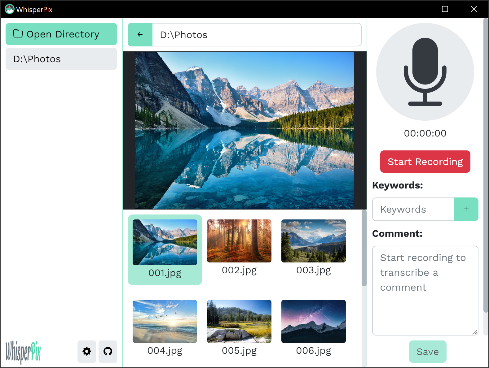

<p align="center">
    
    <br/>
    <i>Turn Whisper transcriptions into EXIF metadata</i>
</p>
<p align="center">
        &#8226; <a href="#install">INSTALL</a><br/>
        &#8226; <a href="#configuration">CONFIGURATION</a><br/>
        &#8226; <a href="#building">BUILDING</a>
</p>
<p align="center">
    
</p>

> WhisperPix uses OpenAI's [Whisper](https://github.com/openai/whisper) speech recognition to accurately transcribe spoken words and save them to a photo's EXIF metadata.

## Install
<a href="https://www.microsoft.com/store/apps/9MTFPKPLBVX4">
   
</a>

Or download the Linux releases [here](https://github.com/graham-walker/WhisperPix/releases/latest).

WhisperPix is open-source. You can download and build the app for Windows or Linux by following the instructions [here](#building).

## Configuration

### Whisper
WhisperPix has the option to transcribe audio with either [whisper.cpp](https://github.com/ggerganov/whisper.cpp) (CPU) or [OpenAI Whisper](https://github.com/openai/whisper) (CPU/GPU).

WhisperPix works out of the box by using an embedded version of whisper.cpp v1.2.1 and tiny model (ggml-tiny.bin) by default.

To use OpenAI Whisper it must first be installed on your machine by running:
```
pip install -U openai-whisper
```
More detailed installation instructions can be found [here](https://github.com/openai/whisper#setup).

### Models
Larger ggml models for whisper.cpp can be downloaded [here](https://github.com/ggerganov/whisper.cpp#ggml-format) and added in WhisperPix's settings menu. **4-bit models are not currently supported.**

OpenAI Whisper will automatically download models on first use.

### EXIF Tags
The EXIF tags WhisperPix saves to can be changed in the settings menu.

Not every image type supports saving every EXIF tag. See the table below for support of common image types:
| EXIF Tag             | **JPEG** | **PNG** | **TIFF** | **WebP** | **GIF** | **MP4** |
| :------------------- | :------: | :-----: | :------: | :------: | :-----: | :-----: |
| **Comment**          | &#x2714; | &#x2714;| **X**    | **X**    | &#x2714;| &#x2714;|
| **XPComment**        | &#x2714; | &#x2714;| &#x2714; | &#x2714; | **X**   | **X**   |
| **UserComment**      | &#x2714; | &#x2714;| &#x2714; | &#x2714; | &#x2714;| &#x2714;|
| **Description**      | &#x2714; | &#x2714;| &#x2714; | &#x2714; | &#x2714;| &#x2714;| 
| **ImageDescription** | &#x2714; | &#x2714;| &#x2714; | &#x2714; | &#x2714;| &#x2714;|
| **Caption**          | &#x2714; | &#x2714;| &#x2714; | &#x2714; | &#x2714;| &#x2714;|
| **Keywords**         | &#x2714; | &#x2714;| &#x2714; | **X**    | &#x2714;| &#x2714;|
| **XPKeywords**       | &#x2714; | &#x2714;| &#x2714; | &#x2714; | **X**   | **X**   |
| **Subject**          | &#x2714; | &#x2714;| &#x2714; | &#x2714; | &#x2714;| **X**   |
| **XPSubject**        | &#x2714; | &#x2714;| &#x2714; | &#x2714; | **X**   | &#x2714;|
| **Artist**           | &#x2714; | &#x2714;| &#x2714; | &#x2714; | &#x2714;| &#x2714;|
| **Copyright**        | &#x2714; | &#x2714;| &#x2714; | &#x2714; | &#x2714;| &#x2714;|
| **Creator**          | &#x2714; | &#x2714;| &#x2714; | &#x2714; | &#x2714;| &#x2714;|
| **Location**         | &#x2714; | &#x2714;| &#x2714; | &#x2714; | &#x2714;| &#x2714;|
| **Title**            | &#x2714; | &#x2714;| &#x2714; | &#x2714; | &#x2714;| &#x2714;|
| **XPAuthor**         | &#x2714; | &#x2714;| &#x2714; | &#x2714; | **X**   | **X**   | 
| **XPTitle**          | &#x2714; | &#x2714;| &#x2714; | &#x2714; | **X**   | **X**   |

SVG & BMP images are not supported.

For comments and keywords to appear in Windows file properties, XPComment should be used instead of Description and XPKeywords instead of Keywords.

### Additional Configuration
Additional settings can be modified by directly editing config.json:
```
# Windows
%USERPROFILE%\AppData\Roaming\whisperpix\config.json

# Linux
~/.config/whisperpix/config.json
```
Additional choices for EXIF tags and models can be added to WhisperPix's settings menu by editing: `modelsAvailable`, `commentTagsAvailable`, `keywordsTagsAvailable`, `tagsAvailable`, `languagesAvailable`.

A comprehensive list of EXIF tags can be found [here](https://exiftool.org/TagNames/EXIF.html).

## Building
To build the app install [Node.js](https://nodejs.org/en/download) 16 or later and run:
```
git clone https://github.com/graham-walker/WhisperPix.git

cd ./whisperpix

npm i

# Windows
npm run pack-windows

# Linux
npm run pack-linux

cd ./out
```

## Roadmap
- [x] Embed whisper.cpp and models
- [ ] Dark aware theme

## Licenses
WhisperPix is [MIT licensed](./LICENSE).

Third-party licenses can be found under [/public/LICENSES.html](./public/LICENSES.html).
